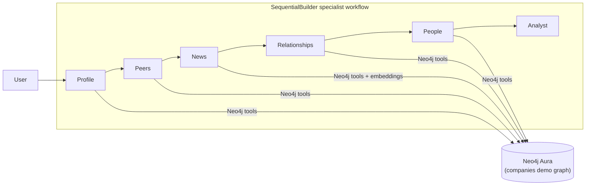

# Microsoft Agent Framework + Neo4j

[Microsoft Agent Framework](https://learn.microsoft.com/agent-framework/overview/) is Microsoft's open-source SDK for building production AI agents in Python and .NET — single agents, multi-agent workflows, and hosted-agent deployment.
Neo4j is the graph database and knowledge layer that grounds those agents in connected enterprise data.

This example wires them together as a multi-agent investment-research assistant: a small set of **specialist agents** gather grounded data from Neo4j, then a final **Analyst** synthesizes the report. One uv-runnable file. Reads `microsoft-foundry/.env` for the Foundry endpoint and Neo4j credentials.

Tool names and return shapes follow the [`EXAMPLE_AGENT.md`](../../../EXAMPLE_AGENT.md) spec ("Industry Research Agent").

## When to pick this path

- You want to see how Agent Framework composes multiple agents.
- A single fat agent with many tools loses focus — splitting work into a few specialists plus an analyst keeps the demo easy to follow while producing sharper, more grounded output.
- Function tools talk to Neo4j directly via the Bolt driver — no MCP server, no extra hop.

## Quick start

```bash
az login
cd microsoft-foundry/infra && ./deploy.sh    # one-time, opt in to Foundry
cd ../../microsoft-agent-framework/examples/multi-agent && uv run multi_agent_neo4j.py
```

`uv` reads the inline `# /// script` deps at the top of `multi_agent_neo4j.py` and runs. The script reads `microsoft-foundry/.env` for the Foundry endpoint, Azure tenant, and Neo4j credentials.

## The workflow



| Stage | Tools | Job |
| --- | --- | --- |
| **Profile / Peers / News / Relationships / People** | Focused subsets of the Neo4j tools | Each specialist handles one facet of the research request and emits strict JSON blocks with raw rows. |
| **Analyst** | none | Reads the accumulated JSON blocks and produces the final structured report. |

Composition is a `SequentialBuilder` chain of six small agents: five research specialists followed by one analyst. The script is intentionally self-contained; [`../foundry-hosted/main.py`](../foundry-hosted/main.py) is a parallel near-identical file packaged for the Foundry hosted-agent runtime.

## Function tools (Neo4j)

Ten read-only functions over the public `companies` demo graph, organised the way the agent picks them — same set as [`microsoft-foundry/examples/foundry-sdk/`](../../../microsoft-foundry/examples/foundry-sdk/):

**Discovery** — `search_companies`, `list_industries`, `companies_in_industry`
**Profile** — `query_company`
**Network** — `analyze_relationships`, `people_at_company`
**News** — `search_news(company_name, query)` (vector — embeds `query` via [`OpenAIEmbeddingClient`](https://learn.microsoft.com/agent-framework/agents/providers/openai) against the Foundry `text-embedding-3-small` deployment, hits the demo graph's 1536-dim `news` index), `articles_in_month`, `get_article`, `companies_in_article`

Plain Python functions with type hints and docstrings. Agent Framework auto-converts them to function tools — no decorator, no schema boilerplate.

## Anti-hallucination contract

The workflow keeps each research step narrow and grounded. Three guarantees in the instructions:

1. **Specialist agents** emit fenced ```json``` blocks per tool call (`tool`, `args`, `rows`). No prose, no summaries.
2. **SequentialBuilder** carries those JSON blocks forward through the shared conversation, so the Analyst sees the raw rows from earlier steps.
3. **Analyst Agent** must cite every `company_id`, `article_id`, title, and relationship type from the rows. Real IDs look like `EIsFKrN_ZNLSWsvxdQfWutQ` / `ART11195006745` — short placeholders ("101", "AWS partnership") are flagged in the prompt as hallucination.

Result: every value in the report appears verbatim in a tool result.

## How it authenticates

- **You → Foundry:** [`AzureCliCredential`](https://learn.microsoft.com/python/api/azure-identity/azure.identity.azureclicredential) pinned to `AZURE_TENANT_ID` from `.env` so it works when `az login` is logged into multiple tenants.
- **You → Neo4j:** the `neo4j` Python driver with username/password from `.env`. Defaults to `companies` / `companies` against the public demo graph.

No Foundry tokens or Neo4j credentials are passed through the model — it sees only the tool schemas and the rows you return.

## Override knobs

Set these in `microsoft-foundry/.env`:

| Variable | Default | Purpose |
| --- | --- | --- |
| `FOUNDRY_QUESTION` | "Research Microsoft's position…" | The single user question. Pick something that exercises both database and analyst. |
| `FOUNDRY_MODEL_DEPLOYMENT_NAME` | `gpt-5-mini` | Model to run all three agents on. |
| `NEO4J_URI` / `NEO4J_DATABASE` / `NEO4J_USERNAME` / `NEO4J_PASSWORD` | demo graph | Point at your own Aura or self-managed Neo4j. |
